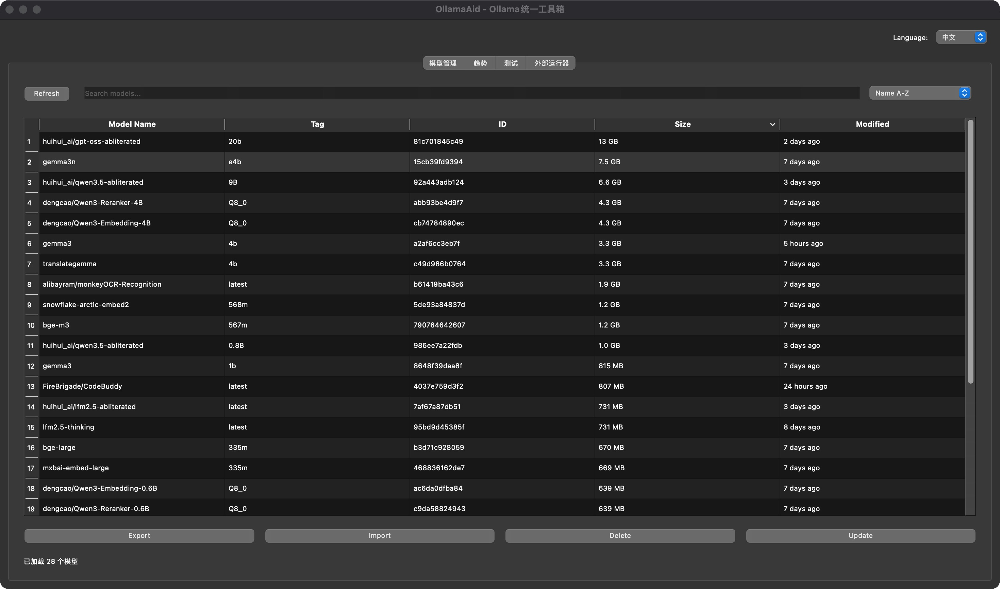
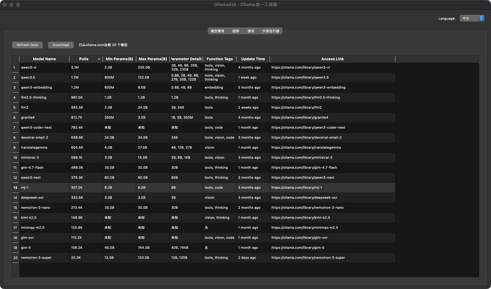
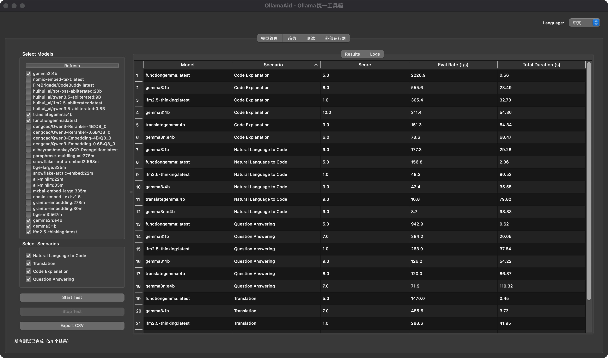

# OllamaAid -- Ollama Model Management, Trends & Testing Assistant

[中文文档](README_CN.md)

OllamaAid provides model management, trend analysis, performance benchmarking, and external runner integration (vLLM / llama.cpp) -- all accessible via CLI, GUI, and Web interfaces.

**Repository:** [github.com/cycleuser/ollamaaid](http://github.com/cycleuser/ollamaaid)

## Features

- **Model Management** -- List, export (GGUF + Modelfile), import, delete, and update Ollama models
- **Trends Viewer** -- Scrape ollama.com for model popularity, parameters, tags, and update info
- **Performance Tester** -- Benchmark models with customizable scenarios, self-evaluation scoring, and CSV export
- **External Runner** -- Launch Ollama-managed models via **vLLM** or **llama.cpp** for better performance and richer parameter control
- **Three Interfaces** -- CLI (`ollama-aid`), PySide6 GUI (`ollama-aid --gui`), Flask Web dashboard (`ollama-aid --web`)
- **Bilingual UI** -- English / Chinese switching in GUI and Web
- **OpenAI Function-Calling** -- Exposes `TOOLS` + `dispatch()` for LLM agent integration
- **PyPI Ready** -- Installable via `pip install ollama-aid`

## Screenshots

### Model Management



### Trends Viewer



### Performance Tester



## Requirements

- Python >= 3.10
- [Ollama](https://ollama.com/) installed and running
- Core: `requests`, `beautifulsoup4`, `lxml`
- GUI (optional): `PySide6`
- Web (optional): `Flask`
- Tester extras (optional): `pandas`, `matplotlib`, `numpy`

## Installation

```bash
# From PyPI
pip install ollama-aid

# With all optional dependencies
pip install ollama-aid[all]

# From source
git clone http://github.com/cycleuser/ollamaaid
cd OllamaAid
pip install -e .
```

## Quick Start

```bash
# List local models
ollama-aid list

# View trending models on ollama.com
ollama-aid trends

# Benchmark models
ollama-aid test llama3.2:3b,qwen3:0.6b -o results.csv

# Run a model via llama.cpp server
ollama-aid run qwen3:0.6b -b llama.cpp --port 8080

# Launch GUI
ollama-aid --gui

# Launch Web dashboard
ollama-aid --web

# Launch Web dashboard on custom port
ollama-aid --web --port 8000
```

## Usage

### CLI Commands

| Command | Description | Example |
|---------|-------------|---------|
| `list` | List local Ollama models | `ollama-aid list --json` |
| `export` | Export model to GGUF + Modelfile | `ollama-aid export llama3:8b -o ./export/` |
| `import` | Import a GGUF file | `ollama-aid import model.gguf -n mymodel` |
| `delete` | Delete a model | `ollama-aid delete llama3:8b -y` |
| `update` | Pull latest version | `ollama-aid update llama3:8b` |
| `info` | Show model details | `ollama-aid info qwen3:0.6b --json` |
| `trends` | Fetch trends from ollama.com | `ollama-aid trends` |
| `test` | Benchmark models | `ollama-aid test model1,model2 -o out.csv` |
| `run` | Start vLLM/llama.cpp server | `ollama-aid run model -b vllm --port 8080` |
| `resolve` | Resolve model to disk path | `ollama-aid resolve qwen3:0.6b` |

### Global Flags

| Flag | Description |
|------|-------------|
| `-V, --version` | Show version |
| `--json` | Output as JSON |
| `-q, --quiet` | Suppress non-essential output |
| `--gui` | Launch PySide6 GUI |
| `--web` | Launch Flask web dashboard |
| `--host` | Host for `--web` (default: `0.0.0.0`) |
| `--port` | Port for `--web` (default: `5000`) |

## Python API

```python
from ollama_aid import list_models, fetch_trends, test_model, run_with_backend, ToolResult

# List models
result = list_models()
print(result.success)   # True
for m in result.data:
    print(m.full_name, m.size)

# Fetch trends
result = fetch_trends()
for t in result.data:
    print(t.name, t.pulls, t.tags)

# Run benchmark
result = test_model(["qwen3:0.6b"], scenarios=None)
for r in result.data:
    print(r.model, r.scenario, r.metrics.eval_rate_tps)

# Start external runner
result = run_with_backend("qwen3:0.6b", backend="llama.cpp", port=8080)
print(result.data)  # {"pid": ..., "host": ..., "port": ...}
```

## Agent Integration (OpenAI Function Calling)

OllamaAid exposes OpenAI-compatible tools for LLM agents:

```python
from ollama_aid.api import TOOLS, dispatch

# Pass TOOLS to OpenAI API
response = client.chat.completions.create(
    model="gpt-4o",
    messages=messages,
    tools=TOOLS,
)

# Dispatch tool calls
for tool_call in response.choices[0].message.tool_calls:
    result = dispatch(
        tool_call.function.name,
        tool_call.function.arguments,
    )
    print(result)  # {"success": True, "data": ...}
```

## CLI Help


### Subcommand: list


### Subcommand: run


### Subcommand: test


### Subcommand: trends


## Project Structure

```
OllamaAid/
├── pyproject.toml                  # Packaging config (setuptools)
├── requirements.txt                # Core dependencies
├── upload_pypi.sh / .bat           # Auto version bump + PyPI + GitHub push
├── LICENSE                         # GPL-3.0
├── README.md                       # English documentation
├── README_CN.md                    # Chinese documentation
├── scripts/
│   └── generate_help_screenshots.py
├── images/                         # Auto-generated CLI screenshots
├── ollama_aid/
│   ├── __init__.py                 # Public exports + __all__
│   ├── __main__.py                 # python -m ollama_aid
│   ├── __version__.py              # Single source of truth for version
│   ├── api.py                      # ToolResult + public API + TOOLS + dispatch()
│   ├── core/
│   │   ├── config.py               # Find Ollama/vLLM/llama.cpp, resolve paths
│   │   ├── i18n.py                 # Bilingual EN/ZH translation
│   │   ├── models.py               # Data classes, Modelfile templates
│   │   ├── manager.py              # OllamaManager: list/export/import/delete/update
│   │   ├── trends.py               # Web scraping ollama.com/search
│   │   ├── tester.py               # Benchmark runner with verbose metric parsing
│   │   └── runner.py               # ExternalRunner for vLLM / llama.cpp
│   ├── cli/main.py                 # argparse CLI with 10 subcommands
│   ├── gui/main.py                 # PySide6 tabbed GUI (4 tabs)
│   └── web/
│       ├── main.py                 # Flask REST API (12 endpoints)
│       └── templates/index.html    # Dark-themed SPA dashboard
└── tests/
    └── test_core.py                # 24 tests across 10 test classes
```

## Development

```bash
# Install in development mode
pip install -e ".[all,test]"

# Run tests
python -m pytest tests/ -v

# Regenerate CLI screenshots
python scripts/generate_help_screenshots.py

# Build and upload to PyPI
bash upload_pypi.sh     # Linux/macOS
upload_pypi.bat         # Windows
```

## License

[GNU General Public License v3.0](LICENSE)
