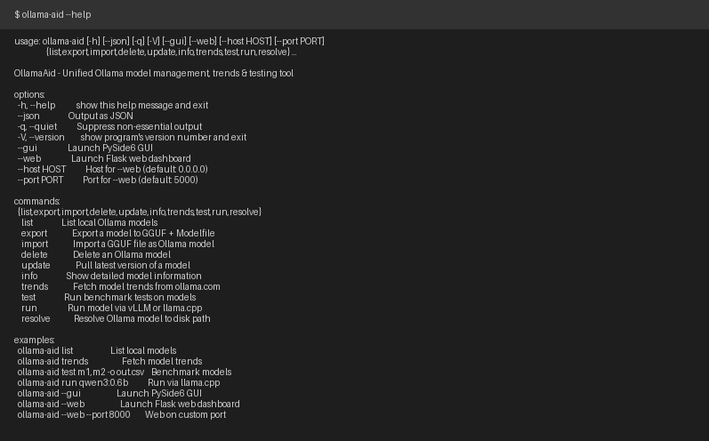
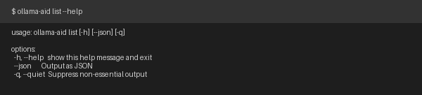
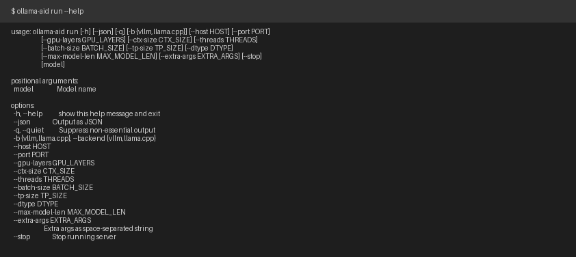
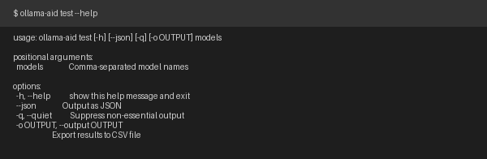
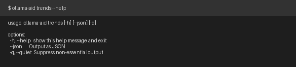

# OllamaAid -- Ollama模型管理、趋势分析与测试统一工具

[English](README.md)

OllamaAid 将 **OllamaTrendsViewer**、**OllamaModelManager** 和 **OllamaModelTester** 的功能整合为一个优雅的工具箱。提供模型管理、趋势分析、性能基准测试以及外部运行器集成（vLLM / llama.cpp）—— 全部通过 CLI、GUI 和 Web 三端访问。

**项目地址:** [github.com/cycleuser/ollamaaid](http://github.com/cycleuser/ollamaaid)

## 功能特性

- **模型管理** -- 列出、导出（GGUF + Modelfile）、导入、删除、更新 Ollama 模型
- **趋势查看** -- 从 ollama.com 抓取模型热度、参数规模、标签、更新信息
- **性能测试** -- 使用可自定义场景对模型进行基准测试，包含自评分和 CSV 导出
- **外部运行器** -- 通过 **vLLM** 或 **llama.cpp** 启动 Ollama 管理的模型，获得更好的性能和更丰富的参数控制
- **三端支持** -- CLI (`ollama-aid`)、PySide6 GUI (`ollama-aid --gui`)、Flask Web 仪表板 (`ollama-aid --web`)
- **中英双语** -- GUI 和 Web 界面支持英文/中文切换
- **OpenAI Function-Calling** -- 提供 `TOOLS` + `dispatch()` 用于 LLM Agent 集成
- **PyPI 就绪** -- 可通过 `pip install ollama-aid` 安装

## 系统要求

- Python >= 3.10
- [Ollama](https://ollama.com/) 已安装并运行
- 核心依赖: `requests`, `beautifulsoup4`, `lxml`
- GUI（可选）: `PySide6`
- Web（可选）: `Flask`
- 测试扩展（可选）: `pandas`, `matplotlib`, `numpy`

## 安装

```bash
# 从 PyPI 安装
pip install ollama-aid

# 安装全部可选依赖
pip install ollama-aid[all]

# 从源码安装
git clone http://github.com/cycleuser/ollamaaid
cd OllamaAid
pip install -e .
```

## 快速开始

```bash
# 列出本地模型
ollama-aid list

# 查看 ollama.com 模型趋势
ollama-aid trends

# 对模型进行基准测试
ollama-aid test llama3.2:3b,qwen3:0.6b -o results.csv

# 通过 llama.cpp 运行模型
ollama-aid run qwen3:0.6b -b llama.cpp --port 8080

# 启动 GUI 界面
ollama-aid --gui

# 启动 Web 仪表板
ollama-aid --web

# 启动 Web 仪表板（自定义端口）
ollama-aid --web --port 8000
```

## 使用方法

### CLI 命令

| 命令 | 描述 | 示例 |
|------|------|------|
| `list` | 列出本地 Ollama 模型 | `ollama-aid list --json` |
| `export` | 导出模型为 GGUF + Modelfile | `ollama-aid export llama3:8b -o ./export/` |
| `import` | 导入 GGUF 文件 | `ollama-aid import model.gguf -n mymodel` |
| `delete` | 删除模型 | `ollama-aid delete llama3:8b -y` |
| `update` | 拉取最新版本 | `ollama-aid update llama3:8b` |
| `info` | 显示模型详细信息 | `ollama-aid info qwen3:0.6b --json` |
| `trends` | 从 ollama.com 获取趋势 | `ollama-aid trends` |
| `test` | 对模型进行基准测试 | `ollama-aid test model1,model2 -o out.csv` |
| `run` | 启动 vLLM/llama.cpp 服务 | `ollama-aid run model -b vllm --port 8080` |
| `resolve` | 解析模型的磁盘路径 | `ollama-aid resolve qwen3:0.6b` |

### 全局参数

| 参数 | 描述 |
|------|------|
| `-V, --version` | 显示版本号 |
| `--json` | 以 JSON 格式输出 |
| `-q, --quiet` | 静默模式，抑制非必要输出 |
| `--gui` | 启动 PySide6 GUI 界面 |
| `--web` | 启动 Flask Web 仪表板 |
| `--host` | `--web` 的主机地址（默认: `0.0.0.0`） |
| `--port` | `--web` 的端口号（默认: `5000`） |

## Python API

```python
from ollama_aid import list_models, fetch_trends, test_model, run_with_backend, ToolResult

# 列出模型
result = list_models()
print(result.success)   # True
for m in result.data:
    print(m.full_name, m.size)

# 获取趋势
result = fetch_trends()
for t in result.data:
    print(t.name, t.pulls, t.tags)

# 运行基准测试
result = test_model(["qwen3:0.6b"], scenarios=None)
for r in result.data:
    print(r.model, r.scenario, r.metrics.eval_rate_tps)

# 启动外部运行器
result = run_with_backend("qwen3:0.6b", backend="llama.cpp", port=8080)
print(result.data)  # {"pid": ..., "host": ..., "port": ...}
```

## Agent 集成（OpenAI Function Calling）

OllamaAid 提供 OpenAI 兼容的工具定义，便于 LLM Agent 集成：

```python
from ollama_aid.api import TOOLS, dispatch

# 将 TOOLS 传递给 OpenAI API
response = client.chat.completions.create(
    model="gpt-4o",
    messages=messages,
    tools=TOOLS,
)

# 分发工具调用
for tool_call in response.choices[0].message.tool_calls:
    result = dispatch(
        tool_call.function.name,
        tool_call.function.arguments,
    )
    print(result)  # {"success": True, "data": ...}
```

## CLI 帮助



### 子命令: list



### 子命令: run



### 子命令: test



### 子命令: trends



## 项目结构

```
OllamaAid/
├── pyproject.toml                  # 打包配置（setuptools）
├── requirements.txt                # 核心依赖
├── upload_pypi.sh / .bat           # 自动版本号递增 + PyPI + GitHub 推送
├── LICENSE                         # GPL-3.0
├── README.md                       # 英文文档
├── README_CN.md                    # 中文文档
├── scripts/
│   └── generate_help_screenshots.py
├── images/                         # 自动生成的 CLI 截图
├── ollama_aid/
│   ├── __init__.py                 # 公共导出 + __all__
│   ├── __main__.py                 # python -m ollama_aid
│   ├── __version__.py              # 版本号唯一定义位置
│   ├── api.py                      # ToolResult + 公共 API + TOOLS + dispatch()
│   ├── core/
│   │   ├── config.py               # 查找 Ollama/vLLM/llama.cpp，解析路径
│   │   ├── i18n.py                 # 中英双语翻译
│   │   ├── models.py               # 数据类、Modelfile 模板
│   │   ├── manager.py              # OllamaManager: 列出/导出/导入/删除/更新
│   │   ├── trends.py               # 网页抓取 ollama.com/search
│   │   ├── tester.py               # 基准测试运行器（verbose 指标解析）
│   │   └── runner.py               # ExternalRunner（vLLM / llama.cpp）
│   ├── cli/main.py                 # argparse CLI，10 个子命令
│   ├── gui/main.py                 # PySide6 标签页 GUI（4 个标签）
│   └── web/
│       ├── main.py                 # Flask REST API（12 个端点）
│       └── templates/index.html    # 深色主题单页仪表板
└── tests/
    └── test_core.py                # 24 个测试，10 个测试类
```

## 开发

```bash
# 开发模式安装
pip install -e ".[all,test]"

# 运行测试
python -m pytest tests/ -v

# 重新生成 CLI 截图
python scripts/generate_help_screenshots.py

# 构建并上传到 PyPI
bash upload_pypi.sh     # Linux/macOS
upload_pypi.bat         # Windows
```

## 许可证

[GNU 通用公共许可证 v3.0](LICENSE)
